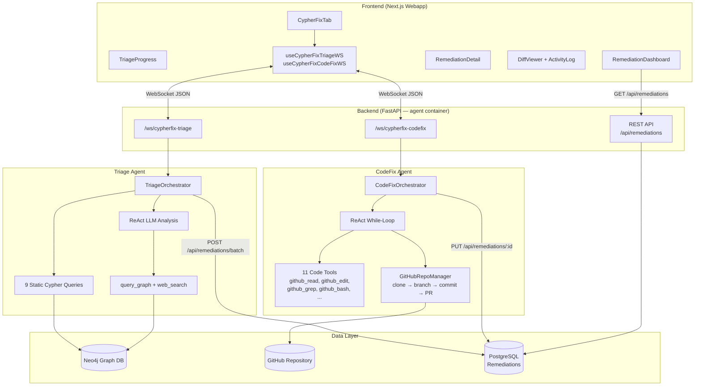
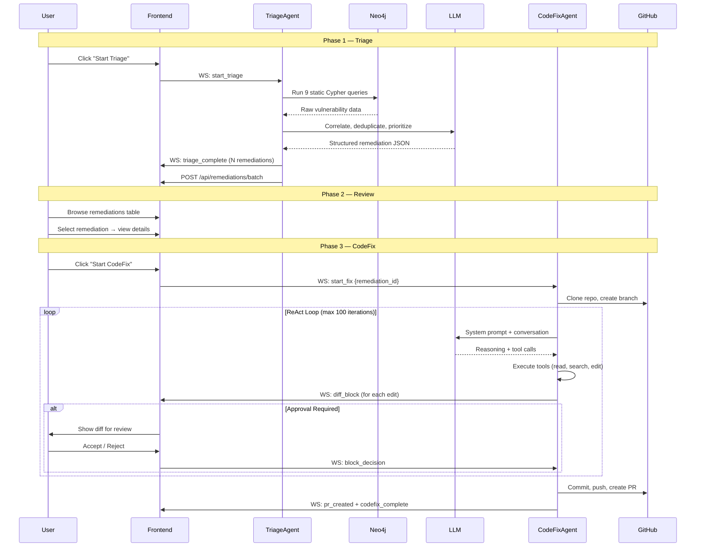
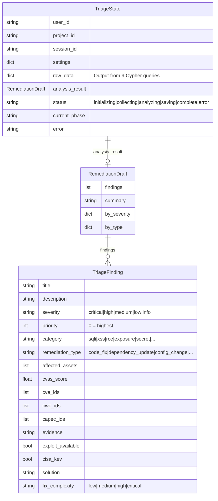
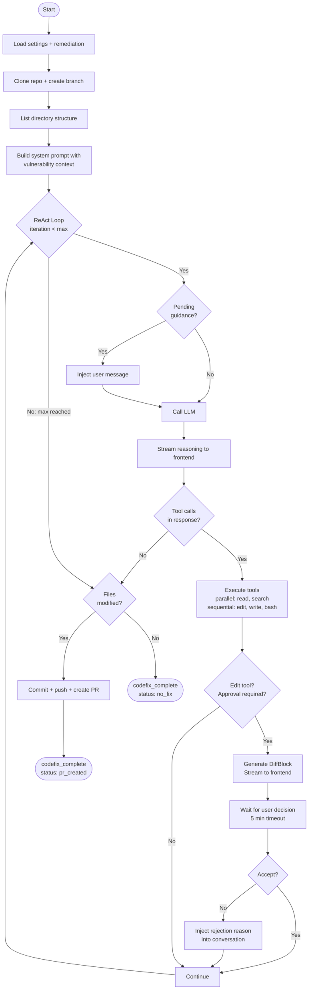
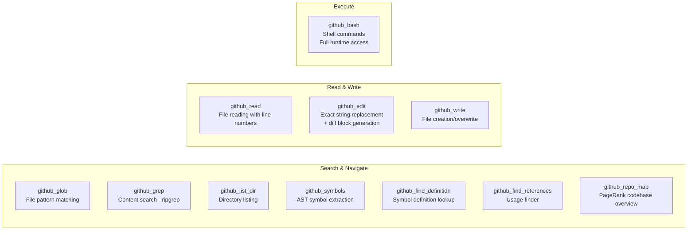
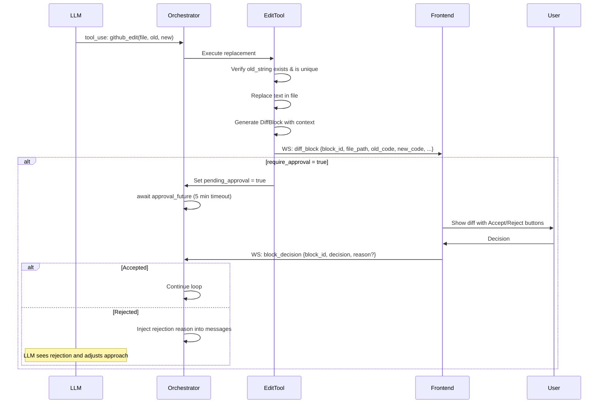
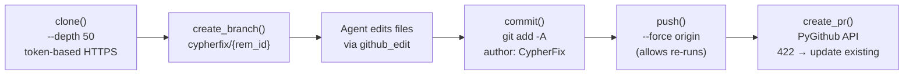
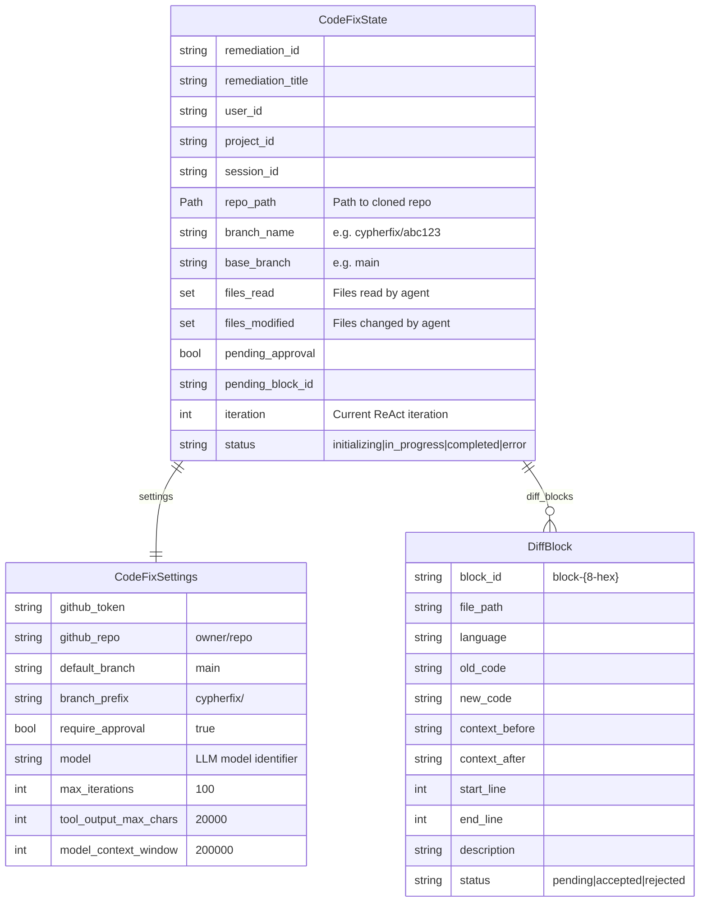
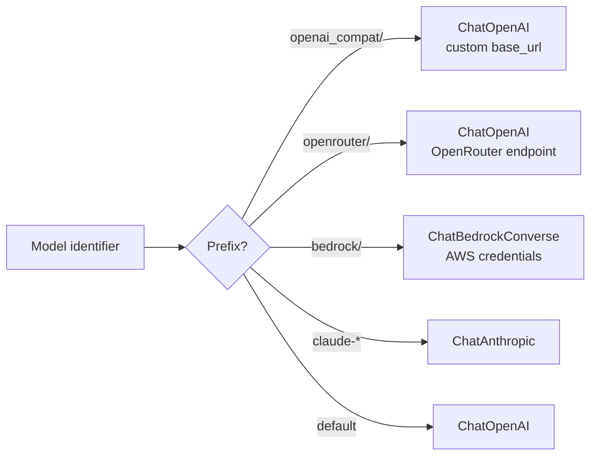

# CypherFix Agents — Vulnerability Triage & Automated Code Remediation

## Overview

**CypherFix** is RedAmon's automated vulnerability remediation pipeline. It bridges the gap between discovering vulnerabilities (via reconnaissance, DAST scanning, and AI-powered pentesting) and actually fixing them in code. The pipeline consists of two independent AI agents that operate in sequence:

1. **Triage Agent** — Analyzes the Neo4j attack surface graph, correlates and deduplicates findings across data sources, prioritizes them using a weighted scoring algorithm, and generates structured remediation entries.
2. **CodeFix Agent** — Takes a single remediation entry, clones the target repository, explores the codebase, implements the fix using a ReAct loop, and opens a pull request.

Both agents run inside the existing `agent` container and communicate with the frontend via dedicated WebSocket connections.

---

## Table of Contents

1. [Architecture Overview](#architecture-overview)
2. [End-to-End Workflow](#end-to-end-workflow)
3. [Triage Agent](#triage-agent)
   - [File Structure](#triage-file-structure)
   - [Hybrid Architecture](#hybrid-architecture)
   - [Phase 1: Static Collection](#phase-1-static-collection)
   - [Phase 2: ReAct Analysis](#phase-2-react-analysis)
   - [Phase 3: Persistence](#phase-3-persistence)
   - [Tools](#triage-tools)
   - [Prioritization Algorithm](#prioritization-algorithm)
   - [State Model](#triage-state-model)
   - [WebSocket Protocol](#triage-websocket-protocol)
4. [CodeFix Agent](#codefix-agent)
   - [File Structure](#codefix-file-structure)
   - [ReAct Loop Architecture](#react-loop-architecture)
   - [Orchestrator Workflow](#orchestrator-workflow)
   - [Tool System](#codefix-tool-system)
   - [Diff Block & Approval Flow](#diff-block--approval-flow)
   - [GitHub Integration](#github-integration)
   - [State Model](#codefix-state-model)
   - [WebSocket Protocol](#codefix-websocket-protocol)
5. [LLM Provider Routing](#llm-provider-routing)
6. [Frontend Integration](#frontend-integration)
7. [Configuration Reference](#configuration-reference)
8. [Container & Runtime Environment](#container--runtime-environment)

---

## Architecture Overview



---

## End-to-End Workflow



---

## Triage Agent

### Triage File Structure

```
agentic/cypherfix_triage/
├── __init__.py
├── orchestrator.py            # Hybrid orchestrator: static collection + ReAct analysis
├── state.py                   # TriageFinding, RemediationDraft, TriageState
├── tools.py                   # Neo4j query manager, Tavily web search, TRIAGE_TOOLS
├── project_settings.py        # Load CypherFix settings from webapp API
├── websocket_handler.py       # WebSocket endpoint + TriageStreamingCallback
└── prompts/
    ├── __init__.py
    ├── system.py              # TRIAGE_SYSTEM_PROMPT (prioritization rules, output format)
    └── cypher_queries.py      # 9 hardcoded Cypher queries for static collection
```

### Hybrid Architecture

The Triage Agent uses a **two-phase hybrid design** — deterministic data collection followed by LLM-powered analysis:

```mermaid
flowchart LR
    subgraph Phase1["Phase 1: Static Collection (No LLM)"]
        direction TB
        Q1[Vulnerabilities]
        Q2[CVE Chains]
        Q3[Secrets]
        Q4[Exploits]
        Q5[Assets]
        Q6[Chain Findings]
        Q7[Attack Chains]
        Q8[Certificates]
        Q9[Security Checks]
    end

    subgraph Phase2["Phase 2: ReAct Analysis (LLM)"]
        direction TB
        CORR[Correlate across sources]
        DEDUP[Deduplicate findings]
        PRIO[Apply priority scoring]
        GEN[Generate remediations JSON]
    end

    subgraph Phase3["Phase 3: Persistence"]
        SAVE[POST /api/remediations/batch]
    end

    NEO4J[(Neo4j)] --> Phase1
    Phase1 -->|Raw data| Phase2
    Phase2 -->|RemediationDraft| Phase3
    Phase3 --> DB[(PostgreSQL)]
```



This design ensures:
- **Deterministic coverage** — all 9 query categories always execute regardless of LLM behavior
- **Cost efficiency** — a single LLM call analyzes all data rather than N separate calls
- **Reproducibility** — the same raw data always gets collected; only the analysis varies

### Phase 1: Static Collection

Nine hardcoded Cypher queries run against Neo4j to collect the full attack surface:

| # | Query Name | Description | Key Nodes |
|---|------------|-------------|-----------|
| 1 | `vulnerabilities` | All vulns with endpoints, parameters, GVM fields | Vulnerability, Endpoint, Parameter |
| 2 | `cve_chains` | Technology → CVE → CWE → CAPEC chains | Technology, CVE, MitreData, Capec |
| 3 | `secrets` | GitHub secrets and sensitive files | GithubRepository, GithubSecret, GithubSensitiveFile |
| 4 | `exploits` | CVEs with confirmed ExploitGvm nodes | ExploitGvm, CVE, Technology |
| 5 | `assets` | Services, ports, IPs, base URLs | Subdomain, IP, Port, Service, BaseURL |
| 6 | `chain_findings` | Pentesting findings (exploit_success, credential_found, etc.) | ChainFinding, ChainStep, AttackChain |
| 7 | `attack_chains` | Attack chain session summaries | AttackChain with targets and outcomes |
| 8 | `certificates` | TLS certificate status (expired, weak, valid) | Certificate, BaseURL |
| 9 | `security_checks` | Missing headers, misconfigurations | Vulnerability (source='security_check') |

All queries are tenant-filtered with `$userId` and `$projectId` parameters. Progress is streamed to the frontend (5%–70% of the progress bar).

### Phase 2: ReAct Analysis

After collection, the raw data is formatted and sent to the LLM with the `TRIAGE_SYSTEM_PROMPT`. The LLM operates in a ReAct loop (max 10 iterations) where it can:

1. **Analyze** the raw data directly
2. **Call `query_graph`** for follow-up Cypher queries when more context is needed
3. **Call `web_search`** to check CISA KEV status, exploit availability, or CVE details
4. **Output** a JSON array of structured remediation entries

The LLM also receives a list of existing non-pending remediations (from previous triage runs) to avoid creating duplicates.

### Phase 3: Persistence

Parsed `TriageFinding` objects are batch-saved via `POST /api/remediations/batch`, which creates rows in the PostgreSQL `Remediation` table.

### Triage Tools

| Tool | Description | Implementation |
|------|-------------|----------------|
| `query_graph` | Run follow-up Cypher queries against Neo4j | `TriageNeo4jToolManager.run_query()` — async Neo4j driver |
| `web_search` | Search the web via Tavily API | `TriageWebSearchManager.search()` — HTTPS to `api.tavily.com` |

### Prioritization Algorithm

The system prompt instructs the LLM to apply weighted scoring:

| Signal | Weight | Description |
|--------|--------|-------------|
| `CHAIN_EXPLOIT_SUCCESS` | 1200 | ChainFinding with `finding_type='exploit_success'` |
| `CONFIRMED_EXPLOIT` | 1000 | ExploitGvm node exists for the CVE |
| `CHAIN_ACCESS_GAINED` | 900 | ChainFinding with `finding_type='access_gained'` or `privilege_escalation` |
| `CISA_KEV` | 800 | `v.cisa_kev=true` |
| `CHAIN_CREDENTIAL` | 700 | ChainFinding with `finding_type='credential_found'` |
| `SECRET_EXPOSED` | 500 | GitHub secret or sensitive file found |
| `CHAIN_REACHABILITY` | 200 | Internet-facing asset to vuln ≤ 3 hops |
| `DAST_CONFIRMED` | 150 | Nuclei DAST finding |
| `INJECTABLE_PARAM` | 100 | Parameter marked `is_injectable=true` |
| `CVSS_SCORE` | 100 | CVSS * 10 (0–100 points) |
| `CERT_EXPIRED` | 80 | Expired TLS certificate |
| `CERT_WEAK` | 40 | Self-signed or weak key |
| `GVM_QOD` | 30 | Quality of Detection ≥ 70 |
| `SEVERITY_WEIGHT` | 50 | critical=50, high=40, medium=20, low=10 |

**Priority = MAX_SCORE - total_weighted_score** (0 = highest priority)

### Triage State Model



### Triage WebSocket Protocol

**Endpoint:** `/ws/cypherfix-triage`

**Incoming messages:**

| Type | Payload | Description |
|------|---------|-------------|
| `init` | `{user_id, project_id, session_id?}` | Initialize session |
| `start_triage` | — | Launch triage pipeline |
| `stop` | — | Cancel running triage |
| `ping` | — | Keepalive |

**Outgoing messages:**

| Type | Payload | Description |
|------|---------|-------------|
| `connected` | `{session_id}` | Session initialized |
| `triage_phase` | `{phase, description, progress}` | Phase update with 0–100 progress |
| `thinking` | `{thought}` | LLM reasoning text |
| `thinking_chunk` | `{chunk}` | Streaming reasoning chunk |
| `tool_start` | `{tool_name, tool_args}` | Tool execution started |
| `tool_complete` | `{tool_name, success, output_summary}` | Tool execution finished |
| `triage_complete` | `{total_remediations, by_severity, by_type, summary}` | Pipeline complete |
| `error` | `{message, recoverable}` | Error occurred |
| `stopped` | — | Triage cancelled |
| `pong` | — | Keepalive response |

---

## CodeFix Agent

### CodeFix File Structure

```
agentic/cypherfix_codefix/
├── __init__.py
├── orchestrator.py            # Pure ReAct while-loop (Claude Code pattern)
├── state.py                   # DiffBlock, CodeFixSettings, CodeFixState
├── project_settings.py        # Load CypherFix settings from webapp API
├── websocket_handler.py       # WebSocket endpoint + CodeFixStreamingCallback
├── prompts/
│   ├── __init__.py
│   ├── system.py              # Dynamic system prompt with remediation context
│   └── diff_format.py         # Instructions for structured diff output
└── tools/
    ├── __init__.py            # CODEFIX_TOOLS schema definitions (11 tools)
    ├── github_repo.py         # GitHubRepoManager: clone, branch, commit, push, PR
    ├── glob_tool.py           # File pattern matching (pathlib)
    ├── grep_tool.py           # Content search (ripgrep wrapper)
    ├── read_tool.py           # File reading with line numbers
    ├── edit_tool.py           # Exact string replacement + diff block generation
    ├── write_tool.py          # File creation/overwrite
    ├── bash_tool.py           # Shell execution with safety checks
    ├── list_dir_tool.py       # Directory listing
    ├── symbols_tool.py        # Tree-sitter AST symbol extraction
    ├── find_definition_tool.py # Symbol definition lookup
    ├── find_references_tool.py # Symbol usage finder
    └── repo_map_tool.py       # PageRank-scored codebase overview
```

### ReAct Loop Architecture

The CodeFix agent replicates **Claude Code's exact agentic design**: a pure ReAct loop where the LLM is the sole controller. There is no hardcoded state machine deciding tool order — the LLM decides which tools to use, when to retry, and when to stop. The orchestrator is simply a **while loop** that calls the LLM, executes its tool requests, feeds results back, and repeats.



### Orchestrator Workflow

The `CodeFixOrchestrator.run()` method executes these phases:

| Phase | Action | Details |
|-------|--------|---------|
| 1. Settings | `load_cypherfix_settings()` | Fetch project config from webapp API |
| 2. Remediation | `GET /api/remediations/:id` | Load vulnerability details (title, CVEs, solution, evidence) |
| 3. Status Update | `PUT /api/remediations/:id` | Set `status: "in_progress"`, clear previous `agentNotes` |
| 4. Clone | `GitHubRepoManager.clone()` | Shallow clone (`--depth 50`), create fix branch `cypherfix/{remediation_id}` |
| 5. Explore | `github_list_dir()` | Get repo structure for system prompt |
| 6. Init LLM | `_init_llm()` | Create LangChain client based on model provider |
| 7. System Prompt | `build_codefix_system_prompt()` | Inject vulnerability details + repo structure + tool rules |
| 8. ReAct Loop | While loop (max 100 iterations) | LLM reasons → tools execute → results feed back |
| 9. Finalize | Commit → Push → PR (or no_fix) | Update remediation status in database |

### CodeFix Tool System

The agent has 11 tools available, mirroring Claude Code's tool set:



#### Tool Details

| Tool | Purpose | Key Behavior |
|------|---------|-------------|
| `github_glob` | Find files by glob pattern | Returns paths sorted by modification time, max 500 results |
| `github_grep` | Search file contents (regex) | Wraps `rg`, supports `files_with_matches`, `content`, `count` modes |
| `github_read` | Read file with line numbers | cat -n format, tracks files in `state.files_read` for edit pre-check |
| `github_edit` | Exact string replacement | Generates `DiffBlock`, streams to frontend, triggers approval flow |
| `github_write` | Create or overwrite file | Creates parent directories, adds to `state.files_modified` |
| `github_bash` | Shell command execution | Blocks dangerous patterns (`rm -rf /`, `mkfs.`), 600s timeout |
| `github_list_dir` | List directory contents | Type indicators (file/dir) |
| `github_symbols` | Tree-sitter AST symbols | Supports 15 languages, extracts functions/classes/methods with line ranges |
| `github_find_definition` | Find symbol definitions | AST-based, skips node_modules/vendor/__pycache__ |
| `github_find_references` | Find symbol usages | AST-based, skips definition nodes and comments |
| `github_repo_map` | Ranked codebase overview | PageRank scoring by cross-reference count, respects token budget |

**Execution strategy:**
- **Parallel**: Search and read tools run concurrently via `asyncio.gather()`
- **Sequential**: Edit, write, and bash tools run one at a time (edit triggers approval check)

### Diff Block & Approval Flow

When `github_edit` executes successfully, it generates a `DiffBlock`:



**DiffBlock fields:**

| Field | Type | Description |
|-------|------|-------------|
| `block_id` | string | Unique ID (`block-{8-hex}`) |
| `file_path` | string | Relative path from repo root |
| `language` | string | Detected from extension (python, javascript, typescript, java, go, ...) |
| `old_code` | string | Original code being replaced |
| `new_code` | string | Replacement code |
| `context_before` | string | 3 lines before the change |
| `context_after` | string | 3 lines after the change |
| `start_line` | int | 1-indexed line number where change starts |
| `end_line` | int | 1-indexed line number where change ends |
| `status` | string | `pending` → `accepted` or `rejected` |

### GitHub Integration

The `GitHubRepoManager` handles all Git and GitHub operations:



| Operation | Details |
|-----------|---------|
| **Clone** | Shallow clone to `/tmp/cypherfix-repos/{owner_repo}`, removes existing dir, 120s timeout |
| **Branch** | `git checkout -b cypherfix/{remediation_id}` |
| **Commit** | Author: `CypherFix <cypherfix@redamon.io>`, stages all changes |
| **Push** | Force-push (allows re-runs on same branch), token sanitized from errors |
| **PR** | Creates via GitHub API; if 422 (already exists), finds and updates existing PR |

### CodeFix State Model



### CodeFix WebSocket Protocol

**Endpoint:** `/ws/cypherfix-codefix`

**Incoming messages:**

| Type | Payload | Description |
|------|---------|-------------|
| `init` | `{user_id, project_id, session_id?}` | Initialize session |
| `start_fix` | `{remediation_id}` | Launch CodeFix for a specific remediation |
| `block_decision` | `{block_id, decision, reason?}` | Accept or reject a diff block |
| `guidance` | `{message}` | Inject user guidance into next ReAct iteration |
| `stop` | — | Cancel running fix |
| `ping` | — | Keepalive |

**Outgoing messages:**

| Type | Payload | Description |
|------|---------|-------------|
| `connected` | `{session_id}` | Session initialized |
| `codefix_phase` | `{phase, description}` | Phase update (cloning_repo, exploring_codebase, implementing_fix, awaiting_approval) |
| `thinking` | `{thought}` | Full LLM reasoning (up to 20K chars) |
| `thinking_chunk` | `{chunk}` | Streaming reasoning chunk |
| `tool_start` | `{tool_name, tool_args}` | Tool execution started (args truncated to 200 chars) |
| `tool_complete` | `{tool_name, success, output_summary}` | Tool finished (summary truncated to 500 chars) |
| `diff_block` | `{block_id, file_path, language, old_code, new_code, ...}` | Code change for user review |
| `block_status` | `{block_id, status}` | Block accepted or rejected |
| `fix_plan` | `{plan}` | Overall fix plan from LLM |
| `pr_created` | `{pr_url, pr_number, branch, title, files_changed, additions, deletions}` | PR opened on GitHub |
| `codefix_complete` | `{remediation_id, status, pr_url?}` | Workflow complete (pr_created, no_fix, or error) |
| `error` | `{message, recoverable}` | Error occurred |
| `stopped` | — | Fix cancelled |
| `pong` | — | Keepalive response |

---

## LLM Provider Routing

Both agents share the same multi-provider routing logic:



| Prefix | Provider | Required Env Var |
|--------|----------|------------------|
| `openai_compat/` | Custom OpenAI-compatible server | `OPENAI_COMPAT_BASE_URL`, `OPENAI_COMPAT_API_KEY` |
| `openrouter/` | OpenRouter | `OPENROUTER_API_KEY` |
| `bedrock/` | AWS Bedrock | `AWS_ACCESS_KEY_ID`, `AWS_SECRET_ACCESS_KEY` |
| `claude-*` | Anthropic | `ANTHROPIC_API_KEY` |
| _(default)_ | OpenAI | `OPENAI_API_KEY` |

Both agents use `temperature=0` for deterministic output. Triage uses `max_tokens=16384`, CodeFix uses `max_tokens=8192`.

---

## Frontend Integration

### Component Tree

```
CypherFixTab
├── EmptyState                         # No remediations yet — "Start Triage" prompt
├── TriageProgress                     # Live triage progress bar + phase indicator
├── RemediationDashboard               # Table of all remediations
│   ├── RemediationFilters             # Severity/status/type filters
│   ├── SeverityBadge                  # Color-coded severity tag
│   ├── StatusBadge                    # Status indicator (pending, in_progress, pr_created, ...)
│   └── RemediationTypeIcon            # Icon for code_fix, dependency_update, etc.
├── RemediationDetail                  # Single remediation detail view
│   ├── EvidenceSection                # Evidence display
│   ├── SolutionSection                # AI-suggested solution
│   └── CodeFixButton                  # "Start CodeFix Agent" trigger
└── DiffViewer                         # CodeFix live activity view
    ├── ActivityLog                    # Chronological log of all agent events
    ├── DiffBlock                      # Individual code diff with syntax highlighting
    │   ├── FileHeader                 # File path + language badge
    │   └── DiffLine                   # Single diff line (addition/deletion/context)
    └── BlockActions                   # Accept/Reject buttons
```

### WebSocket Hooks

| Hook | Endpoint | Purpose |
|------|----------|---------|
| `useCypherFixTriageWS` | `/ws/cypherfix-triage` | Manages triage session, progress tracking |
| `useCypherFixCodeFixWS` | `/ws/cypherfix-codefix` | Manages codefix session, activity log, diff blocks, approval flow |

### Standalone Page

`/cypherfix` — A dedicated page (`webapp/src/app/cypherfix/page.tsx`) that provides a standalone remediations dashboard outside the graph view, accessible from the global header.

---

## Configuration Reference

CypherFix settings are stored per-project in the PostgreSQL `Project` model and loaded at runtime:

| Setting | DB Field | Default | Used By |
|---------|----------|---------|---------|
| GitHub Token | `cypherfixGithubToken` | — | CodeFix (repo operations) |
| Default Repository | `cypherfixDefaultRepo` | — | CodeFix (clone target) |
| Default Branch | `cypherfixDefaultBranch` | `main` | CodeFix (base branch) |
| Branch Prefix | `cypherfixBranchPrefix` | `cypherfix/` | CodeFix (fix branch naming) |
| Require Approval | `cypherfixRequireApproval` | `true` | CodeFix (user must approve each edit) |
| LLM Model | `cypherfixLlmModel` | — | Both agents (fallback: `agentOpenaiModel`) |

### Environment Variables

| Variable | Default | Description |
|----------|---------|-------------|
| `WEBAPP_API_URL` | `http://webapp:3000` | Webapp API base URL |
| `CYPHERFIX_REPOS_BASE` | `/tmp/cypherfix-repos` | Base directory for cloned repos |
| `NEO4J_URI` | `bolt://neo4j:7687` | Neo4j connection (triage) |
| `NEO4J_USER` | `neo4j` | Neo4j username |
| `NEO4J_PASSWORD` | `redamon_neo4j` | Neo4j password |
| `TAVILY_API_KEY` | — | Tavily web search API key (triage) |
| `OPENAI_API_KEY` | — | OpenAI API key |
| `ANTHROPIC_API_KEY` | — | Anthropic API key |
| `OPENROUTER_API_KEY` | — | OpenRouter API key |
| `OPENAI_COMPAT_BASE_URL` | — | Custom OpenAI-compatible endpoint |
| `OPENAI_COMPAT_API_KEY` | — | Custom OpenAI-compatible API key |
| `AWS_ACCESS_KEY_ID` | — | AWS credentials for Bedrock |
| `AWS_SECRET_ACCESS_KEY` | — | AWS credentials for Bedrock |

---

## Container & Runtime Environment

Both agents run inside the existing `agent` Docker container. The container ships with a full set of language runtimes so the CodeFix agent can build, test, and lint any target repository:

| Runtime | Version | Commands |
|---------|---------|----------|
| **Node.js** | 20 LTS | `node`, `npm`, `npx`, `yarn`, `pnpm` |
| **Python** | 3.11 | `python3`, `pip` |
| **Go** | 1.22 | `go build`, `go test`, `go mod` |
| **Ruby** | 3.3 | `ruby`, `gem`, `bundler` |
| **Java** | OpenJDK 21 | `java`, `javac`, `mvn` |
| **PHP** | 8.4 | `php`, `composer` |
| **.NET** | SDK 8.0 | `dotnet build`, `dotnet test` |
| **Build tools** | — | `make`, `gcc`, `g++` |
| **Utilities** | — | `git`, `ripgrep (rg)`, `jq`, `curl`, `wget`, `unzip`, `file`, `ssh` |

### Docker Compose

```yaml
agent:
  volumes:
    - ./agentic:/app                          # Source code (live mount)
    - cypherfix-repos:/tmp/cypherfix-repos    # Cloned repos for CodeFix
```

The `cypherfix-repos` named volume provides persistent storage for cloned repositories during CodeFix runs. Repos are cleaned up after each session.

### System Prompt

The CodeFix system prompt is dynamically built per-remediation and includes:
- Agent identity and ReAct behavior rules
- Available runtimes and tools
- Vulnerability details (title, severity, CVEs, affected assets, evidence, solution)
- Repository structure (from `github_list_dir`)
- Tool usage rules (read before edit, uniqueness checks, indentation preservation)
- Security guidelines (parameterized queries, output encoding, allow-lists)
